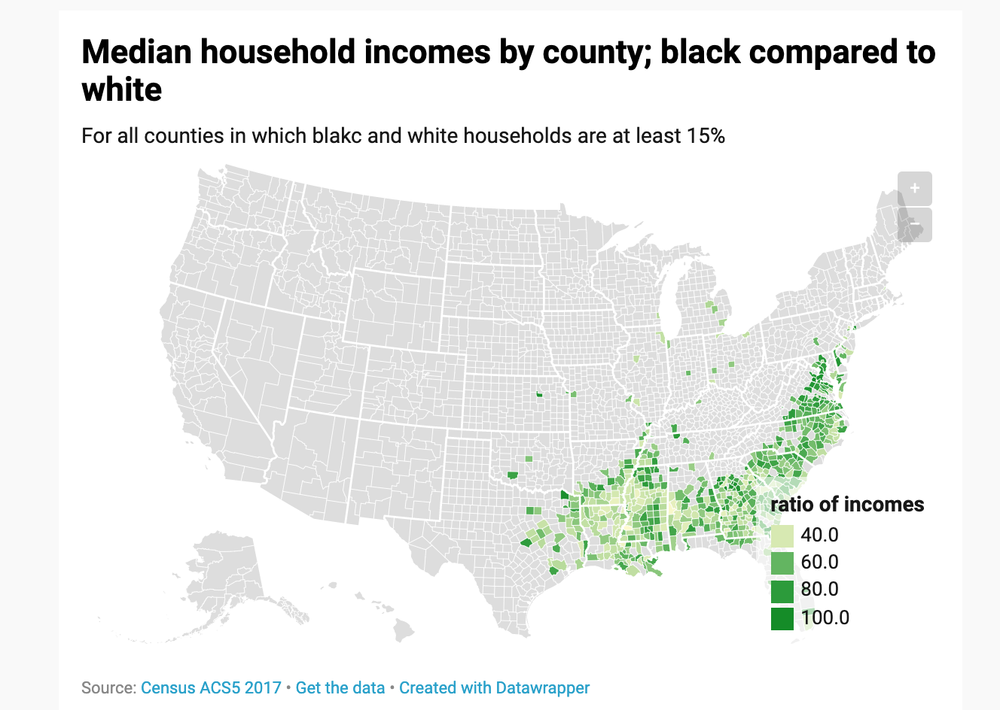

# Poynter Census Data Workshop 2019

## repo-shortlink: [bit.ly/cdata2019](https://bit.ly/cdata2019)

This repo contains slides and notes for the "Hands-on Data Training" session for [Poynter's Covering the Census Workshop held on June 7, 2019](https://www.poynter.org/covering-the-census-chicago/#1549662376277-7e2acdf9-0a298297-4e4f), sponsored by the [McCormick Foundation](https://donate.mccormickfoundation.org/)

To get to this page via short URL, use: [bit.ly/cdata2019](https://bit.ly/cdata2019)

## Starters

- Should probably sign up for a Google Account (to use Google Sheets) if you don't have one by now
- Visit [https://censusreporter.org](https://censusreporter.org) and fill out this little anonymous data collection form (to be analyzed as an example in class): [http://bit.ly/zipgform](http://bit.ly/zipgform)
- [Optional] Sign-up for a free [datawrapper.de account](https://www.datawrapper.de/) to make visualizations

## Exploring CensusReporter 

Open and browse the pages for:

- [The United States](https://censusreporter.org/profiles/01000US-united-states/)
- [Illinois](https://censusreporter.org/profiles/04000US17-illinois/)
- [Chicago](https://censusreporter.org/profiles/16000US1714000-chicago-il/)
- [Census Tract 3201, Cook, IL](https://censusreporter.org/profiles/14000US17031320100-census-tract-3201-cook-il/) which is the tract for the address [205 North Michigan Avenue, Chicago, Illinois 60601,](https://censusreporter.org/locate/?lat=41.886024&lng=-87.623542&address=205%20North%20Michigan%20Avenue,%20Chicago,%20Illinois%2060601,%20United%20States)
- Some other town/city not Chicago (e.g. where you lived before moving here, or where you last visited)

Take notice at:

- Look at what data points are emphasized by CensusReporter
- Look at how data changes in quality/interest-level as you move from one geographic category to another
- Compare what the Census data says to what you assume about these places

### Slides: Exploring data presentation in CensusReporter and elsewhere

Census data is so overwhelming that it's best to use a site like CensusReporter as a navigation tool to what is important (or worth prioritizing), how things are labeled, and where data can be found:

https://dannguyen.github.io/poynter-census-data-2019/slides/content/exploring-census-reporter

-------------------------

### Spreadsheet warmup with our collected data

> Note: the best thing you can do to understand data is to get [familiar with spreadsheets](https://multimedia.journalism.berkeley.edu/tutorials/spreadsheets/) and use them as often as possible (more than daily!). That's the most important skill, but we won't have time to get through it in this workshop.

The class data from the [Google Form](http://bit.ly/zipgform) should be here to use:

http://bit.ly/warmzipcode

#### Spreadsheeting our data collection 

- Make a copy of the spreadsheet for yourself (so you can edit it)
- Make a column that shows the percentage-point difference between the "White %" values of people's "work area" and their "origin zip code"
- Make a column that shows the ratio of origin-zip-code median household income to work-area-median-household-income
- Try to make a visualization from these derived columns

------------------------

## Cleaned Census Data warmup

The spreadsheet at [http://bit.ly/blueredhello](http://bit.ly/blueredhello) contains cleaned up **state-level data** from two sources: 

- Census: the state-level 2017 ACS-1-year DP03 (selected economic characteristics) data: http://bit.ly/2017econstates
- Elections: Data [courtesy of Dave Leip's Atlas](https://docs.google.com/spreadsheets/d/1VWo5ZuNIFZ726I5bfmDJwBlGEjd43qR3nuCDKY9-_vE/edit#gid=1312827112) / http://bit.ly/leip2016copy

Try to make some charts from it using Google Sheets. An example workbook can be found here: https://docs.google.com/spreadsheets/d/13YknXg46P6NVA-1dRFYVAbFQQxmEdG0YSiDmU2uKgxE/edit#gid=1536535436

## Charts in datawrapper

Data visualization tools all have varying features, but they have the same principles when it comes to structure of data (rows and columns, essentially).

Try to make: [Poverty bar chart colored by state presidential vote](https://river.datawrapper.de/_/ohOGU)

Point datawrapper to Google Sheet found at: http://bit.ly/blueredhello

## Choropleth map basics

One of the best features of datawrapper.de is its easy-choropleth-mapping (density maps)

Copy-paste data found at: http://bit.ly/blueredhello

Let's make:

- a [U.S. map of the states shaded by 2016 electoral results](https://datawrapper.dwcdn.net/oFPwJ/1/)
- a [U.S. map of the states shaded by poverty rate or median household income](https://datawrapper.dwcdn.net/W5vyS/1/)

## BREAK --------------------------------

--------

## Race and ethnicity data, by counties

- 2017 ACS5 median-household-income-by-race, by counties: [http://bit.ly/purplegolf](http://bit.ly/purplegolf)
- How do we tidy it?
- How do we [wrangle it](https://docs.google.com/spreadsheets/d/1Q9n8bgFQkts8-hpyEatwLJ4BWCQYzd1oYpmrwKHKs0o/edit#gid=930696376)? 
- Make choropleths: [black household incomes compared to white by county](https://www.datawrapper.de/_/IS6hS/)

## How to fetch data from FactFinder and data.census.gov

- Go in knowing that the data you want exists, maybe the survey/table where it came from, and ideally, a specifically value to spot-check (i.e. use CensusReporter)

### American FactFinder strategy

Go to [Advanced Search](https://factfinder.census.gov/faces/nav/jsf/pages/searchresults.xhtml?refresh=t)

- First, choose the smallest geographical region you want to work with. The smaller the geo-category, the less data options you have (e.g. ACS-1-year does not exist for Census tracts, or small towns)
- Then search by the general topic ("race" or "poverty")
- Filter by year
- Finally, browse the results and select the table that best fits what you need

### data.census.gov

Maybe? (site seems down, randomly) https://data.census.gov/cedsci/advanced

